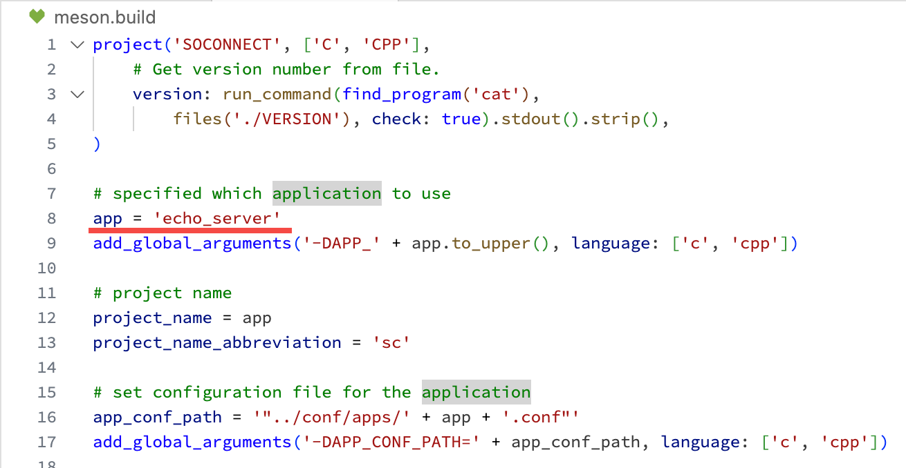

# SoConnect

**SoConnect** (SC) is a benchmark-oriented framework for fastly developping DPDK application, which integrate DOCA and CUDA support, one can use this framework for rapidly developping your own benchmark that can be tested on either x86 server or ARM SoC.


## Preparation

1. Install DPDK and setup DPDK environment (e.g. hugepage, etc.)

2. (Optional) Install and setup DOCA and CUDA environment

2. Install other dependencies

```bash
sudo apt-get install libgmp3-dev
python3 -m pip install meson
python3 -m pip install ninja
```

## Usage

1. Change the `app` within `meson.build` to build your desired application, full application list can be found under `src/apps/.app_list`;

<div align="center">
    
</div>

2. Run the following command to build your application

```bash
meson build && cd build
ninja
```

3. Change the configurations under `conf`, these configuration files include:

<div align="center">
    <table>
        <tr>
            <th align="center">File</th>
            <th align="center">Description</th>
        </tr>
        <tr>
            <td align="center">dpdk.conf</td>
            <td>Configuration of DPDK including cores, port and queue, etc.</td>
        </tr>
        <tr>
            <td align="center">doca.conf</td>
            <td>Configuration of DOCA (if enabled)</td>
        </tr>
        <tr>
            <td align="center">app/*.conf</td>
            <td>Configuration of each applications</td>
        </tr>
    </table>
</div>

4. To execute the application binary, run (p.s. assume `echo_client` was built):

```bash
sudo ./echo_client
```

## Develop your own benchmark

Assume your new benchmark application's name is `newapp`:

1. **Add Configuration File**: add custom configuration file `newapp.conf` to `conf/apps`

2. **Add Headers**: 
   * Duplicate `include/apps/sc_template` under `include/apps` as `include/apps/sc_newapp`;
   * Change filename of `include/apps/sc_newapp/template.hpp` to `include/apps/sc_newapp/newapp.hpp`;
   * Change the macro `_SC_TEMPLATE_H_` within `include/apps/sc_newapp/newapp.hpp` to `_SC_NEWAPP_`;

3. **Add Headers**: 
   * Duplicate `src/apps/sc_template` under `src/apps` as `src/apps/sc_newapp`;
   * Change filename of `src/apps/sc_newapp/template.cpp` to `include/apps/sc_newapp/newapp.cpp`;
   * Change the macro `include/apps/sc_newapp/newapp.cpp` to include `sc_newapp/newapp.h` instead of  `sc_template/template.h`;

4. Add `newapp` into `src/apps/.app_list`;

    > TODO: Develop a automatical script to finish above 1~4's logic

5. Start develop your benchmark's logic;

6. Change the selected application inside `meson.build` to build your benchmark